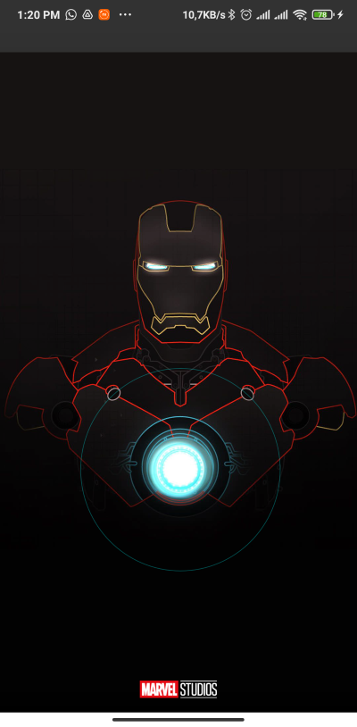
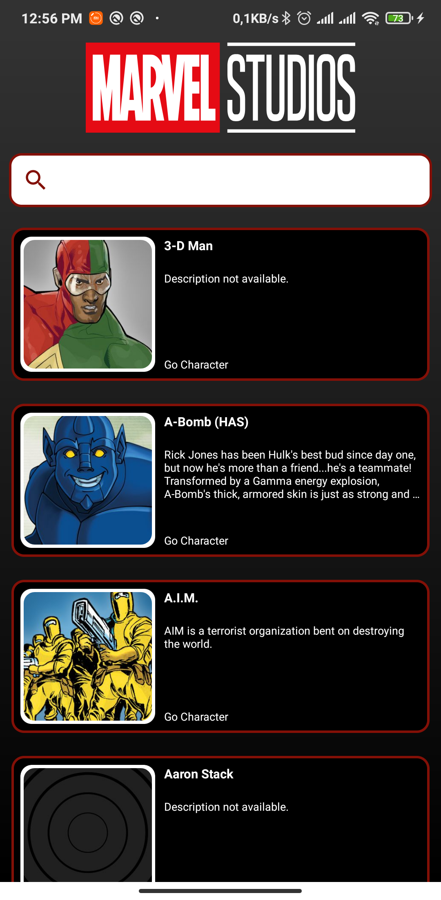
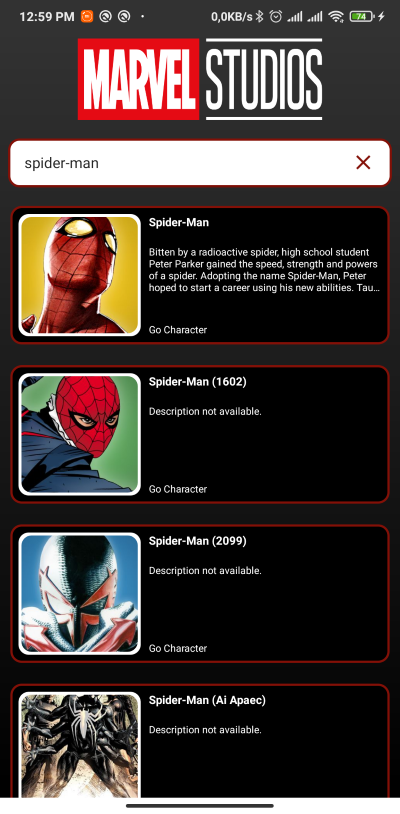
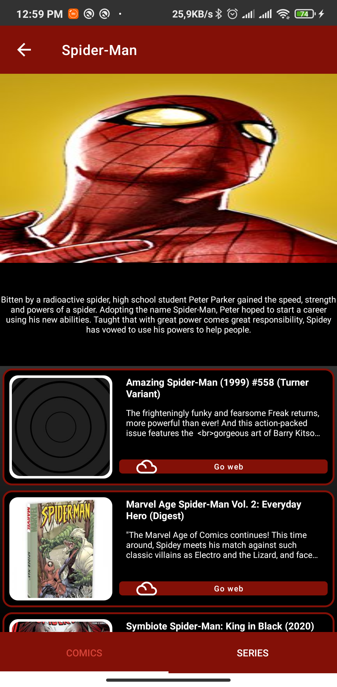
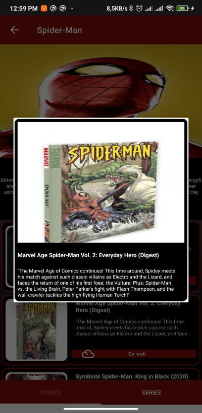

# Marvel Info
Learn about Marvel characters provided by Marvel Comics
 
 
 ## This project was implemented with the MVVM pattern

Android Version:
 * min: 24
 * max: 30

Libraries implemented:
* Lottie
* Glide
* Jackson
* Koin
* Retrofit
* Firebase Analytics
* Firebase Crashlytics

You can download the application at https://play.google.com/store/apps/details?id=com.jvmartinez.marvelinfo

Preview Viewo
* https://youtu.be/Zc0ZduCSf7M

